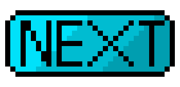

# [1/9] Hello world from Starman chatbot

Hello! Welcome to your first exercise and your first step towards a Starman chatbot!
In this exercise you will write a simple Hello World chatbot. 

But before doing anything, make sure you have fulfilled the workshop prerequisites.

First, go to your terminal and create your chatbot's project folder. You can name it any way you like.
While there, initalize your Node project by running `npm init` and filling up the project details.

Next, install Claudia Bot Builder as your project dependency by running `npm install claudia-bot-builder --save`.

Now, in your project folder, create a `bot.js` file that will be the starting point for your chatbot.

Your first task is to write a chat bot that will always reply with `Hello from Starman bot`. To see how to dot it with Claudia Bot Builder, take a look at [Claudia Bot Builder API docs](https://github.com/claudiajs/claudia-bot-builder).

After you've written it, be sure to create your AWS Lambda function and deploy your chatbot by running `claudia create --region eu-central --api-module bot.js`.

## Tips

Here are a few tips that can help you to do this exercise:

- You can skip NPM questions by running the `npm init` command with `-y` flag.
- Claudia Bot Builder is a function that accepts callback and options and returns an instance of Claudia API Builder.
- Claudia Bot Builder calls the callback function you provided with `message` object that contains `text` attribute with message received from user. 
- You need to export result from `botBuilder` function using `module.exports`.
- By default, Claudia Bot Builder deploys all supported platforms, you can speed up the deployment by selecting only platforms you want to use, as explained [here](https://github.com/claudiajs/claudia-bot-builder/tree/master/docs#selecting-platforms).

You can see our solution in a [code section](../code/exercise-01) of this repository.

---

or [go back](../Dialogflow-setup.md).